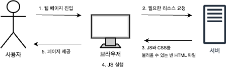
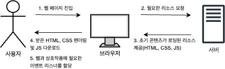

# CSR과 SSR

## 들어가며
북마크 토이 프로젝트를 진행하기 위해 `Next.js` 기본 개념을 학습하면서 배운
CSR과 SSR의 개념과 차이점에 대해 정리해본다.

- CSR? SSR?
- CSR과 SSR의 차이
- 검색엔진과 SSR
- 개념 활용

## CSR과 SSR이란?
> CSR: Client Side Rendering

**클라이언트 측에서 브라우저 렌더링을 담당**하는 방식이다.   

서버는 (JS, CSS)를 포함한 빈 HTML을 브라우저에 전달하고  
이를 받은 브라우저 단에서 JS를 실행하여 화면을 그린다.

즉, 크롬 브라우저에서 JS 실행옵션을 꺼놓으면 빈 화면만 보인다.

> SSR: Server Side Rendering

처음에 서버에서 렌더링을 하고 브라우저는 HTML과 CSS를 보여주고   
받은 JS를 다운로드 후 실행하여 사용자와 웹 페이지간의 상호작용을 제공한다.

요약하자면, 렌더링을 누가 하느냐에 따라 `CSR`인지 `SSR`인지를 결정한다.

## 차이점

두 개념은 이해했으니 장단점을 파악해보자.

`CSR`은 서버에서 리소스를 처리하는 시간이 비교적 빠르기에 **TTFB(Time to First Byte)가 빠르다**    
하지만, 브라우저에서 모든 렌더링을 처리하기 때문에 사용자가 컨텐츠를 볼 수 있는 **FCB(First Contentful Paint)는 느리다.**

`SSR`은 서버에서 렌더링을 처리하기에 **FCB(Fisrt Contentful Paint)가 빠르다.**   
하지만, 사용자와 웹 브라우저 간의 **상호작용이 가능한 시간(TBT: Total Blocking Time)이 필요하다**는 단점이 있다.

## SEO과 SSR

SSR의 장점을 구글링하면, `검색엔진 시스템에 적합하다`라는 글이 많다.

그 이유는, 구글의 검색엔진은 HTML을 기반으로 크롤링을 실행한다.   
다시 말하자면, 웹 페이지의 초기 HTML의 내용으로 검색엔진을 만든다는 것이다.

이러한 이유로 첫 로딩 시 빈 HTML을 가진 **CSR 기반 사이트는 검색엔진이 읽을 수 있는 것이 없다**.   
반면에 **SSR 기반 사이트는 서버에서 받은 HTML에 내용이 있기 떄문에 검색엔진이 읽을 수 있는 내용이 있으므로 SEO에 적합하다**.

## 개념 활용

앞서 정리한 내용은 `Next`를 사용하면서 꼭 알아둬야하는 개념이라고 생각한다.   
그 이유는 React와 Next를 쓸 때 `"use client"`라는 명령어는 한 번 쯤 써봤을 것이다.

예를 들면, 현재 url의 정보를 가져오려면 `usePathname`훅을 사용한다.

아무 생각 없이 훅을 사용하다 보면 아래와 같은 에러내용을 확인할 수 있다.

간단히 말하자면, `Next`의 모든 디렉토리는 서버 컴포넌트이기에 발생하는 오류이므로   
`usePathname` 브라우저 전용 훅이기에 클라이언트 컴포넌트에서 사용해야하며,    
그 해결책으로 상단에 `"use client"`를 명시해라는 내용이다.

여기서 "use client"는 클라이언트 컴포넌트를 명시하기 위해 사용해야 한다는 것을 알 수 있다.

하지만, 주의해야할 점은 "use client"를 사용한 파일은 클라이언트 컴포넌트이구나 라고 생각하면 오산이다.   
기본적으로 **Next는 서버 컴포넌트라**는 것을 잊지 말자.

따라서 내가 이해한 내용은 아래와 같다.

> `use client` 는 "브라우저와 상호작용 할 내용이 필요해!" 라는 메시지를 의미하며, JS 코드를 읽는다
