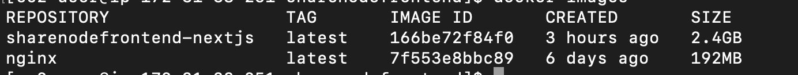
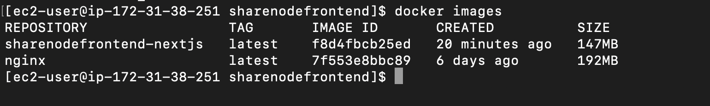

# EC2 인스턴스에 Docker로 nextjs 프로젝트 올리기

## 들어가며
사이드 프로젝트를 시작하기 앞서, CI/CD를 구축하면서 학습한 내용을 정리해본다.
(EC2 인스턴스 설정, 도커 설치는 생략)

- Docker 환경에서 nginx와 nextjs 프로젝트 이미지를 구동해보기
- nginx 80포트를 접속하면 3000포트로 리다이렉트
- nextjs 프로젝트 이미지 용량 줄이기


### Docker에서 nginx와 nextjs 프로젝트 이미지 구동시키기

1. nextjs 프로젝트 상단에 `Dockerfile` 작성하기
    > Dockerfile은 Docker Image를 생성하기 위한 스크립트임
    
    처음에는 아래와 같이 간단하게 작성했다.
    ```shell
    FROM node:18-alpine AS base # node v18을 베이스 이미지로 사용
    
    WORKDIR /usr/src/app # 작업 디렉토리 설정
    
    COPY package.json ./ # yarn install을 위해 package.json 복사
    
    RUN yarn # Dependency 설치
    
    COPY . . # 전체 디렉토리 복사
    
    RUN yarn build # 빌드 실행
    
    EXPOSE 3000 # 3000포트 열기
    
    CMD ["yarn", "start"] # 실행
    ```
    참고로, 빌드를 `standalone` 옵션으로 수행한다면 실행 명령어를 `node ./next/standalone/server.js`로 수정해야 한다.   
    (나는 `package.json` 파일에서 `start` 명령어를 직접 수정해줬다.)
    
    여기까지가 nextjs 프로젝트 빌드 이미지를 생성하기 위함이다.
    다음으로는 `ngnix` 이미지를 생성해준다.
    두 개의 이상의 이미지를 도커 환경에서 실행시키려면 `docker-compose`를 사용해야한다.

2. `docker-compose.yml`로 nginx 이미지 생성과 nextjs 빌드 이미지 실행하기

    ```shell
    version: '3'
    
    services:
      nextjs:
        container_name: sharenode-front # 이미지 실행하면 생성되는 컨테이너 이름 설정
        build: 
          context: ./ # 현재 프로젝트 위치 명시
          dockerfile: ./Dockerfile # 현재 프로젝트 내 Dockerfile 위치 명시
        restart: always # always 컨테이너가 멈추면 항상 다시시작 함, 수동으로 중지된 경우 재시작되거나 컨테이너 자체가 수동으로 재시작될때만 재시작됨
        ports:
          - "3000:3000"
    
      nginx:
        image: nginx:latest # 도커 허브에서 이미지 가져옴
        container_name: web_server
        ports:
          - "80:80"
        volumes:
          - ./nginx.conf:/etc/nginx/conf.d:rw
        depends_on: # 위 nextjs 작업이 끝나면 실행한다는 의미
          - nextjs
    
    networks:
      my_network: # 두 개의 다른 컨테이너를 하나의 네트워크로 관리하여 통신함 
        external: true
    ```

3. 도커 실행하기
    
    `docker compose up -d`   
    `-d` 옵션은 백그라운드에서 실행하겠다는 의미이다.

    위 명령어를 치고나서 ec2에 존재하는 퍼블릭 IP로 접근(포트 80) 하면 nginx 실행 화면을 볼 수 있다.

4. 80포트 3000포트로 포워딩하기

    nextjs 기반 프로젝트을 `yarn dev` 명령어는 3000포트로 열리게 되므로, 자동으로 3000포트를 80포트로 포트포워딩을 하고 싶었다.   
   (물론 yarn dev 실행 시 80포트로 열리게 하면 이 작업은 필요없다.)
    ```shell
    #nginx.conf
    upstream next-app{
            server nextjs:3000;
    }
    server {
            listen 80;
            location / {
                    proxy_pass http://next-app;
                    proxy_set_header   Host $host;
                    proxy_set_header   X-Real-IP $remote_addr;
                    proxy_set_header   X-Forwarded-For $proxy_add_x_forwarded_for;
            }
    }
    ```
   
    `upstream`은 여러대의 컴퓨터가 순차적으로 어떤 일을 처리 할 때 어떤 서비스를 받는 서버를 의미한다.   
    또한, nginx 내장 모듈로 nginx의 부하분산과 속도개선과 같은 역할을 한다.

### nextjs 프로젝트 이미지 용량 줄이기


위에서 작성한 `DockerFile`로 생성된 이미지 용량은 너무 크다..(2.4GB...)
그래서 용량을 줄이고자 구글링해서 아래와 같이 `DockerFile` 내용을 변경했다.

```shell
FROM node:18-alpine AS deps
RUN apk add --no-cache libc6-compat

# 명령어를 실행할 디렉터리 지정
WORKDIR /usr/src/app

# Dependancy install을 위해 package.json, package-lock.json, yarn.lock 복사
COPY package.json yarn.lock ./

# Dependancy 설치 (새로운 lock 파일 수정 또는 생성 방지)
RUN yarn --frozen-lockfile


# 1단계: next.js 빌드 단계
FROM node:18-alpine AS builder

# 명령어를 실행할 디렉터리 지정
WORKDIR /usr/src/app

# node_modules 등의 dependancy를 복사함.
COPY --from=deps /usr/src/app/node_modules ./node_modules
COPY . .

RUN yarn build

# 2단계:  next.js 실행 단계
FROM node:18-alpine AS runner

# 명령어를 실행할 디렉터리 지정
WORKDIR /usr/src/app

# container 환경에 시스템 사용자를 추가함
RUN addgroup --system --gid 1001 nodejs
RUN adduser --system --uid 1001 nextjs

# next.config.js에서 output을 standalone으로 설정하면
# 빌드에 필요한 최소한의 파일만 ./next/standalone로 출력이 된다.
# standalone 결과물에는 public 폴더와 static 폴더 내용은 포함되지 않으므로, 따로 복사를 해준다.
COPY --from=builder --chown=nextjs:nodejs /usr/src/app/.next/standalone ./
COPY --from=builder --chown=nextjs:nodejs /usr/src/app/.next/static ./.next/static

EXPOSE 3000

CMD ["yarn", "start"]                                
```

먼저, 도입한 방법은 멀티 스테이지 빌드이다.   
즉, 빌드용 이미지와 배포용 이미지를 따로 만들어서 복사하는 방식이다.   
(파일을 복사할 때, 필요한 파일만 하면 더 줄어든다는데...아직 프로젝트 셋팅 단계라서 추후에 수정해봐야겠다!)

내가 하면서 막혔던 부분은 nextjs를 `standalone` 옵션으로 빌드하니 계속해서 `.next/static` 경로에 있는 디렉토리들을 찾지를 못하는 오류가 발생했다.
찾아보니, `standalone`옵션은 빌드에 필요한 최소한의 파일만 `./next/standalone`으로 출력되므로 해당 디렉토리 내에는 `public`폴더와 `static`폴더 내용은 포함되지 않는다.
그러므로 빌드 결과물 내 `public`과 `static` 디렉토리를 복사해줘야한다.



그림과 같이 `2.4GB` -> `147MB`로 줄였다!