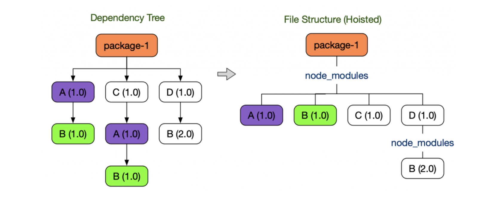
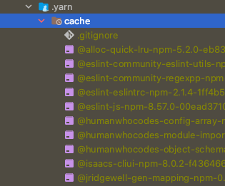

# Package Manager


## 들어가며

회사 동기들과 `yarn berry`에 대해 알아보다가 `패키지매니저`와 `npm`의 의존성 관리에 대해 학습한 내용을 정리해본다.

- 패키지 매니저와 동작 원리
- npm의 의존성 관리

## 패키지 매니저란?
> 패키지를 다루는 작업을 편리하고 안전하게 수행하기 위해 사용되는 툴

쉽게 말하자면, `import`문이나 `require()`를 사용하여 외부 의존성을 참조하는 것을   
올바르게 참조할 수 있도록 보장해주는 역할을 수행하는 것이다.

```javascript
import React from 'react';
require('react');
```


## 패키지 매니저의 동작 단계

패키지 매니저는 `Resolution` - `Fetch` - `Link` 단계로 동작한다.

1. Resolution 단계
   - `package.json`을 읽어 명시된 버전 범위에 따라 정확한 버전을 결정한다.
   - 의존성의 의존성을 확인하고 버전을 결정하여 `package-lock.json`을 작성한다.

2. Fetch 단계
    - 앞서 Resolution 단계에서 결정된 버전을 실제로 다운로드한다.
    - 99%는 npm 레지스트리에서 가져온다.

3. Link 단계
    - 앞서 Fetch 단계에서 가져온 라이브러리를 소스에서 사용할 수 있는 환경을 제공한다.
    - `npm`, `pnmp`, `PnP`등 패키지 매니저 종류에 따라 차이가 있다.
    

## `npm` 의존성 관리
 
`package.json`에 있는 모든 의존성을 `node_modules`에 하나씩 디렉토리를 구성하는 방법

```
my-service/
└─ node_modules/
|  ├─ react/
|  |  
|  └─ redux/
|     └─ node_modules/
|         └─ symbol-observable
|
└─ src
    └─ index.ts
```

예를 들어, 위 구조를 보면 `my-service` 프로젝트에서 `react`와 `redux`를 사용한다면,   
`my-service`의 `node_modules`에 `react`와 `redux` 패키지를 추가하고   
`redux`에서 사용하는 의존성을 파악한 뒤 `node_modules`가 있다면 또 그 밑으로 패키지를 추가해주는 과정으로 진행된다.

이러한 `node_modules`는 여러 단점이 있다.

첫째, **비효율적인 의존성 검색**


```
$ node
> require.resolve.paths('react')
[
  '/Users/bagchaeyeon/Documents/study/book-mark/repl/node_modules',
  '/Users/bagchaeyeon/Documents/study/book-mark/node_modules',
  '/Users/bagchaeyeon/Documents/study/node_modules',
  '/Users/bagchaeyeon/Documents/node_modules',
  '/Users/bagchaeyeon/node_modules',
  '/Users/node_modules',
  '/node_modules',
  '/Users/bagchaeyeon/.node_modules',
  '/Users/bagchaeyeon/.node_libraries',
  '/usr/local/lib/node',
  '/Users/bagchaeyeon/.node_modules',
  '/Users/bagchaeyeon/.node_libraries',
  '/usr/local/lib/node'
]

```

토이 프로젝트로 개발하고 있는 디렉토리에서 `require()`문으로 `react` 패키지를 불러오는 상황일 때,   
위에 보이는 목록처럼 `npm`은 패키지를 찾기위해 계속 상위 디렉토리의 `node_modules`를 탐색한다.

즉, 의존성이 깊어질 수록 패키지를 탐색하는 속도가 현저히 떨어지게 된다.

둘째, **유령 의존성**

`npm`은 호이스팅(Hoisting) 기법으로 의존성을 관리한다.




왼쪽 트리에서 `A(1.0)`과 `B(1.0)` 패키지는 두 번 설치해야하므로 디스크 공간 낭비가 발생한다.
이러한 트리를 `npm`과 `yarn`은 오른쪽 트리처럼 바꾼다.

따라서, `package-1`에서는 원래 `B(1.0)`패키지를 참조할 수 없었지만, 참조할 수 있게 된다.   
이와 같이 **직접 의존하고 있지 않은 라이브러리를 참조할 수 있는 현상**을 `유령 의존성(Phantom Dependency)`이다.

실제로 `npm`패키지를 사용하는 회사 `node_moduels`에서도 이러한 현상을 볼 수 있었다.

```
company-service/
└─ node_modules/
|  ├─ react/
|  ├─ core-js/
|  |
|  └─ recharts/
|  |  └─ node_modules/
|  |      └─ core-js/
|  |      └─ classnames/
|  |      └─ react-smooth/
|  |      └─ ...
|  |
|  └─ react-tap-event-plugin/
|     └─ node_modules/
|         └─ core-js/
|         └─ ...
|
└─ src

```

`company-service`의 `package-json`에는 `core-js`에 대해 명시하지 않았다.   
하지만 `react-tap-event-plugin`와 `recharts` 패키지 내부에 `core-js`를 사용하기 때문에   
최상단 `node_moduels`에 설치되었다.

마지막으로, 의존성 수가 많아지게 되면 `node_modules`가 커지게 되면서
개발자가 `npm install`로 환경을 초기 셋팅하거나 패키지 업데이트로 인해 배포가 필요하는 경우 빌드 시간이 오래 걸린다는 단점이 있다.

## `Yarn Berry` 의존성 관리

`package.json`에 있는 모든 의존성을 `.yarn/cache`에 의존성들을 zip 파일로 압축 저장하고, `.pnn.cjs` 파일에 의존성을 찾을 수 있는 정보를 기록한다.



이처럼 Zip 아카이브로 의존성을 관리하면 다음과 같은 장점이 있다.

1. 더이상 node_moduels를 생성할 필요가 없기 때문에 설치가 빠르다.
2. 각 패키지 버전마다 하나의 Zip 아카이브만 가지기에 중복 설치가 되지 않는다.
3. `node_modules` 처럼 의존성을 끌어올리지 않기 때문에 `package.json`에 기술하는 의존성만 접근 할 수 있다.
4. 의존성을 관리할 때, `node_modules`는 전체를 지우고 재설치 한 적이 많았지만, Zip 아카이브는 변경된 의존성이나 빠지 의존성을 찾기 쉽다.
5. 용량이 작으므로 `Git`과 같은 버전 관리 툴을 이용할 수 있다(`Zero-Install`) ➞ 동료와 100% 동일 환경을 보장함

## 마무리

생각보다 `yarn berry`에 대한 개념과 장점은 단순하다.(단점은 직접 사용해보면서 기입 해보겠다)   
이러한 장점이 많기 때문에 `node_modules`를 벗어나 `yarn berry`를 도입해보자   
[yarn berry 도입기](https://github.com/chyeon97/TIL/blob/main/yarn%20berry%20%EB%8F%84%EC%9E%85%ED%95%98%EA%B8%B0.md)